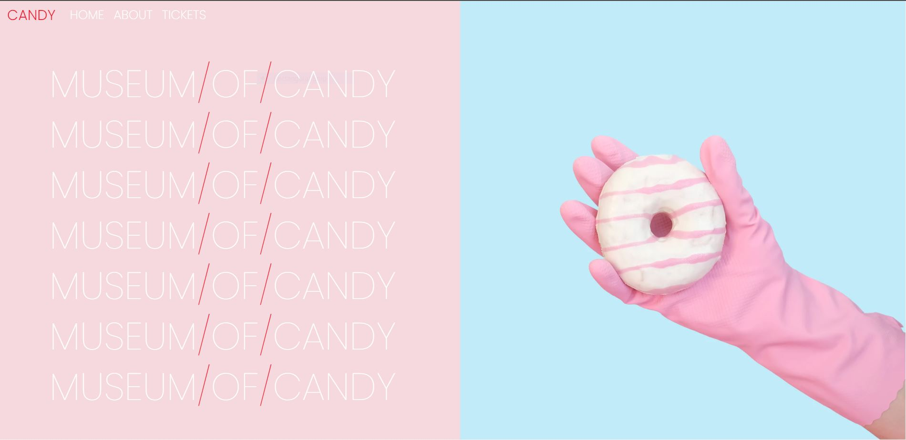

# Museum Of Candy :lollipop: (Udemy Project)

To View The Demo : [Click Here](https://snehap02.github.io/museum-of-candy/).

## :purple_circle: Bootstrap CDN links to include in your .html and .js file :- 

1. Place the &lt;link&gt; tag in the <head> for our CSS
*  &lt;link href="https://cdn.jsdelivr.net/npm/bootstrap@5.2.1/dist/css/bootstrap.min.css" rel="stylesheet" integrity="sha384-iYQeCzEYFbKjA/T2uDLTpkwGzCiq6soy8tYaI1GyVh/UjpbCx/TYkiZhlZB6+fzT" crossorigin="anonymous" &gt;

 

2. Place the &lt;script&gt; tag for our JavaScript bundle (including Popper for positioning dropdowns, poppers, and tooltips) before the closing &lt;/body&gt;.
* &lt;script src="https://cdn.jsdelivr.net/npm/bootstrap@5.2.1/dist/js/bootstrap.bundle.min.js" integrity="sha384-u1OknCvxWvY5kfmNBILK2hRnQC3Pr17a+RTT6rIHI7NnikvbZlHgTPOOmMi466C8" crossorigin="anonymous"&gt;&lt;/script&gt;
 

* &lt;script src="https://cdn.jsdelivr.net/npm/@popperjs/core@2.11.6/dist/umd/popper.min.js" integrity="sha384-oBqDVmMz9ATKxIep9tiCxS/Z9fNfEXiDAYTujMAeBAsjFuCZSmKbSSUnQlmh/jp3" crossorigin="anonymous"&gt;&lt;/script&gt;
* &lt;script src="https://cdn.jsdelivr.net/npm/bootstrap@5.2.1/dist/js/bootstrap.min.js" integrity="sha384-7VPbUDkoPSGFnVtYi0QogXtr74QeVeeIs99Qfg5YCF+TidwNdjvaKZX19NZ/e6oz" crossorigin="anonymous"&gt;&lt;/script&gt;
